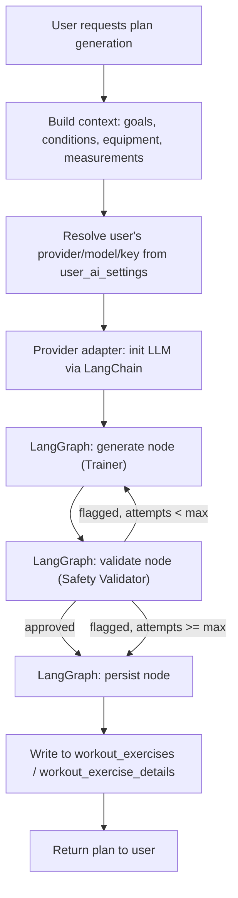

# AI Integration Plan

Goal: generate personalized workout plans via LLMs, with the provider swappable
per user (already modeled by `ai_providers` / `ai_models` / `user_ai_settings`),
following the existing `routers → controllers → services → repositories`
layering. `langchain` is already a dependency and stays the provider-agnostic
adapter — no need to hardcode against one vendor's SDK. `langgraph` (currently
only a transitive dependency of `langchain` per `uv.lock`) becomes a direct
dependency: the generate → validate → retry-or-persist flow is exactly the
kind of stateful, looping control flow LangGraph is for, rather than a
hand-rolled Python loop.

## Personas

| Persona | Job | One-liner |
|---|---|---|
| **Trainer (Generator)** | Drafts the workout plan from user context | `plan_draft = generate_node(state)` |
| **Safety Validator** | Independently reviews the draft against injuries/conditions/equipment before it reaches the user | `verdict = validate_node(state)` |
| **Progress Coach** *(later phase)* | Reviews logged `workout_exercise_details` and proposes plan adjustments | `revision = progress_coach.review(user_id, plan_id)` |

A single persona that both drafts and self-checks a plan is prone to
confirmation bias — it's the one thing worth building as two separate LLM
calls even in phase 1, given health data is involved. With LangGraph, each
persona is a node in one compiled graph instead of two services wired
together by ad-hoc if/else code.

## Build steps

1. **AI settings CRUD** — `user_ai_settings` has a schema but no
   repository/service/controller/router yet. Build the standard layer stack so
   a user can pick provider + model + key.
   `ai_settings_service.get_active_setting(user_id) -> UserAiSettings`

2. **Provider adapter** — one thin wrapper around LangChain's
   `init_chat_model`, parameterized by the resolved `ai_providers`/`ai_models`
   row, so no service code ever imports a vendor SDK directly.
   `llm = init_chat_model(model=setting.ai_model.name, model_provider=setting.ai_provider.name, api_key=setting.api_key, base_url=setting.api_url)`

3. **Context builder** — assemble goal answers, conditions, equipment access,
   and body measurements into one structured object fed to both personas.
   `context = plan_context_builder.build(user_id)`

4. **Graph state** — a `TypedDict` shared across nodes: context, plan_draft,
   verdict, attempt count.
   `class PlanState(TypedDict): context: dict; plan_draft: dict | None; verdict: str | None; attempts: int`

5. **Trainer node** — calls the LLM with a structured-output schema (Pydantic)
   for the plan shape, writes `plan_draft` into state.
   `graph.add_node("generate", generate_node)`

6. **Safety Validator node** — checks `plan_draft` against
   `context.conditions` / `context.equipment`, writes `verdict` into state.
   `graph.add_node("validate", validate_node)`

7. **Conditional routing** — approved → persist; flagged → back to `generate`;
   flagged past a max-attempt cap → persist anyway with the last verdict
   attached, so a stuck loop can't run forever.
   `graph.add_conditional_edges("validate", route_on_verdict, {"approved": "persist", "flagged": "generate", "max_retries": "persist"})`

8. **Persist node + compile** — writes the approved plan into
   `workout_exercises` / `workout_exercise_details`, then the graph ends.
   `plan_graph = graph.compile()`

9. **Router** — expose the flow.
   `POST /api/plans/generate → PlanController.generate_plan(user_id)` calling
   `await plan_graph.ainvoke(initial_state)`

10. *(Later)* **Progress Coach** — a separate entrypoint into the same
    compiled graph (or a small subgraph reusing the `generate`/`validate`
    nodes) triggered off tracked sets/reps/weight instead of fresh intake data.

## Flow graph

The dashed loop (`E → F → E`) is the reason this is a graph rather than a
straight-line service call: LangGraph tracks `attempts` in state across the
cycle and the max-retry edge guarantees termination.

## Note on existing schema

`user_ai_settings.api_key` is currently a plaintext column. Since API keys are
credentials, encrypt at rest (e.g. app-level encryption before insert, decrypt
only inside the provider adapter) before this ships — don't let it round-trip
through logs or response payloads.
